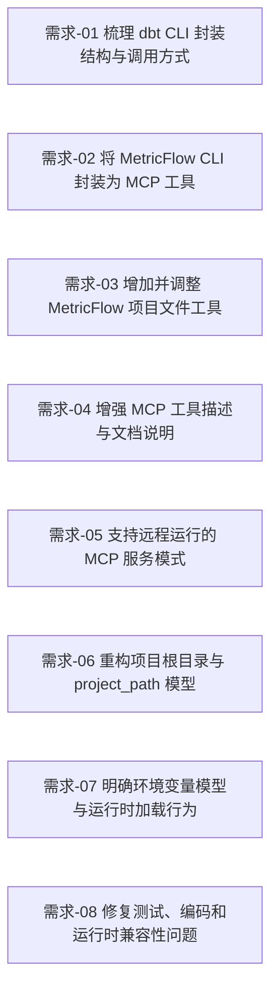

# dbt-mcp 需求关系图

## 文字关系

- 当前没有明确的替代关系。

## Mermaid 关系图

```mermaid
flowchart LR
    dbt-cli-architecture["需求-01 梳理 dbt CLI 封装结构与调用方式"]
    metricflow-cli-tools["需求-02 将 MetricFlow CLI 封装为 MCP 工具"]
    metricflow-project-files["需求-03 增加并调整 MetricFlow 项目文件工具"]
    tool-descriptions["需求-04 增强 MCP 工具描述与文档说明"]
    remote-service-mode["需求-05 支持远程运行的 MCP 服务模式"]
    project-root-model["需求-06 重构项目根目录与 project_path 模型"]
    env-loading["需求-07 明确环境变量模型与运行时加载行为"]
    testing-compatibility["需求-08 修复测试、编码和运行时兼容性问题"]
```
